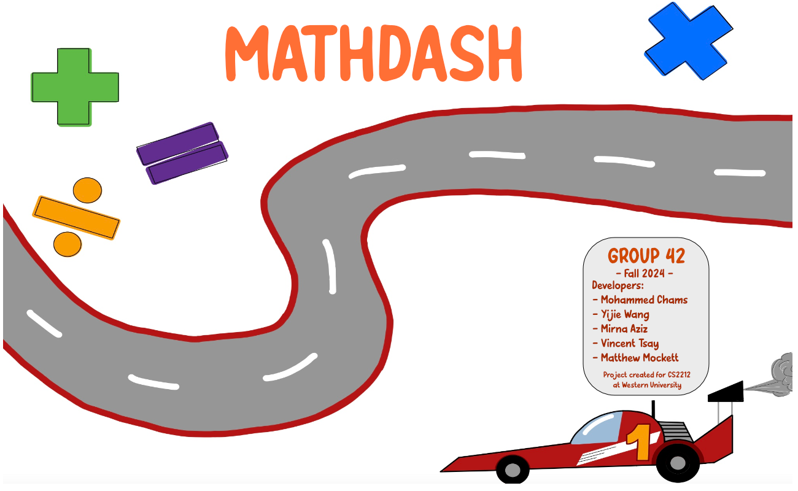

# Math Race Educational Game

A Java-based educational game developed as part of the CS2212 (Introduction to Software Engineering) course at Western University. Math Race helps elementary school students practice math skills through an engaging racing format where players compete against a CPU opponent.

## Project Overview

Math Race is designed to make learning math fun and interactive. Players race against a CPU opponent by correctly answering math questions across different operations (addition, subtraction, multiplication, and division). The game features multiple difficulty levels, tracks player progress across sessions, and provides an instructor dashboard for teachers to monitor student performance.

## Key Features

- **Multiple Math Operations**: Practice addition, subtraction, multiplication, and division skills
- **Progressive Difficulty**: 10 levels for each math operation with increasing complexity
- **Race-based Gameplay**: Compete against a CPU opponent whose difficulty scales with level
- **Player Profiles & Progress Tracking**: Save and resume progress across multiple sessions
- **High Score System**: Competitive leaderboard shows top 5 players
- **Daily Login Bonus**: Rewards consistent practice with points
- **Audio Feedback**: Sound effects for correct/incorrect answers and background music
- **Instructor Dashboard**: Password-protected area for teachers to track student progress
- **Keyboard Shortcuts**: 
  - P: Pause game
  - S: Save game
  - M: Mute/unmute audio
- **User Feedback System**: Players can submit feedback about the game

## Game Flow

1. **Login/Registration**: Enter your player ID to begin
2. **Section Selection**: Choose a math operation (Addition, Subtraction, Multiplication, Division)
3. **Difficulty Selection**: Select from available difficulty levels (levels unlock as you progress)
4. **Gameplay**: Race against CPU by answering math questions correctly
5. **Progress**: Completing a level unlocks the next difficulty level
6. **Points System**: Earn points for correct answers and completing levels

## Screenshots

### Main Menu

*MathDash main menu showing the racing theme and math operators*

### How to Play

*Tutorial screen explaining race mechanics and answer submission*

### Game Interface

*The racing interface where players compete against the CPU*

### Difficulty Selection

*Screen for selecting difficulty levels for each math operation*

### Section Selection

*Selection screen for different math operations*

### High Scores

*Leaderboard showing top player performances*

## Technical Implementation

### Architecture
- **Model-View Separation**: Clear division between game logic and UI elements
- **Design Patterns**: Implementation of Memento pattern for game state management

### Components
- **Player System**: Comprehensive player tracking with progress persistence
- **Question Generator**: Dynamically creates appropriate math questions based on operation and difficulty
- **Race Mechanics**: Dual racetracks with player and CPU advancement 
- **Audio System**: Background music and sound effect management
- **Data Persistence**: CSV-based storage for player data and high scores

## How to Run

### Prerequisites
- Java JDK 17 or newer
- At least 512MB of RAM
- Windows 10 or newer (may work on other platforms but is untested)

### Installation
1. Download the latest release
2. Extract the ZIP file to a location of your choice
3. Run the MathRaceGame.jar file by double-clicking it or using the command:
   ```
   java -jar MathRaceGame.jar
   ```

### Teacher Mode Access
To access the instructor dashboard:
1. Click the graph icon in the main menu
2. Enter the password: "ducklover"

### Debug Mode Access
For development and testing purposes, a debug button is located at coordinates (1220, 260) on the main menu screen.

## Development Team

- Andrew - Player system, data management
- Matthew Lee-Mockett - CPU opponent implementation
- Mohammed - Daily login bonus, instructor dashboard
- Vincent - Scoreboard, tutorial page, math question generator
- Yijie Wang - Audio system, UI components, question frame

## File Structure

- **Model Classes**:
  - `Player.java` - Player data structure and methods
  - `CPUPlayer.java` - CPU opponent logic
  - `Question.java` - Math question representation
  - `MathQuestionGenerator.java` - Creates appropriate questions by level/section
  - `PlayerRaceTrack.java` & `CpuRaceTrack.java` - Race progression tracking
  - `SaveGameManager.java` - Data persistence
  - `Scoreboard.java` - High score management
  - `DailyLoginBonus.java` - Daily login rewards

- **View Classes**:
  - `GUI5.java` - Main application window
  - `GamePage.java` - Main gameplay screen
  - `selectSectionPage.java` - Math operation selection
  - `selectDifficultyPage.java` - Difficulty level selection
  - `QuestionFrame.java` - Question display and answer interface
  - `InstructorDashboard.java` - Teacher monitoring interface
  - `TutorialPage.java` - Game instructions

- **Utility Classes**:
  - `AudioPlayer.java` - Handles audio playback
  - `SoundUtils.java` - Sound effect utilities

## Credits

Developed by Team 42 as part of the CS2212 course at Western University (Winter 2024).
